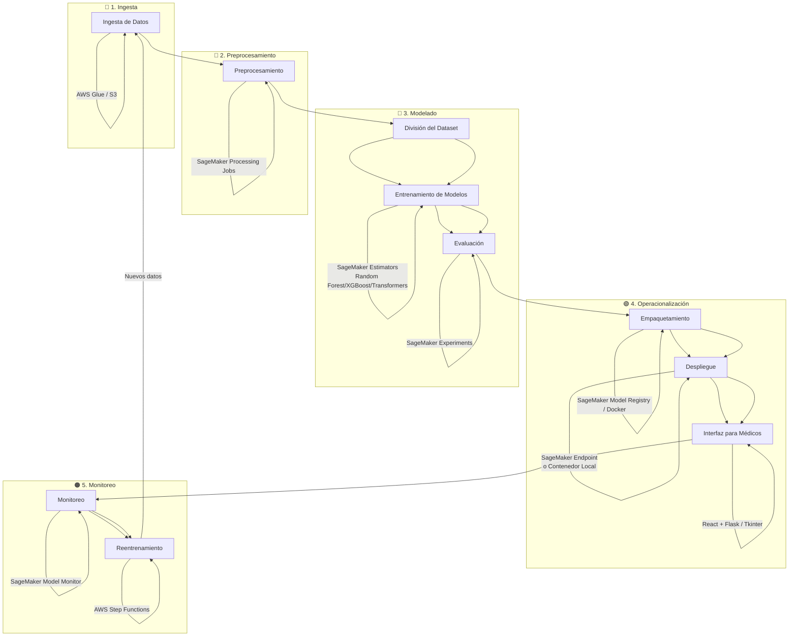

# Propuesta Rediseñada del Pipeline de MLOps - Diagnóstico de Enfermedades Comunes y Huérfanas

## Objetivo

Diseñar un pipeline de Machine Learning capaz de predecir, a partir de los síntomas y datos clínicos de un paciente, si este podría estar afectado por una enfermedad común o una enfermedad huérfana. Este pipeline debe cubrir desde la ingesta de datos hasta el monitoreo en producción, incluyendo despliegue tanto local como en la nube.

---

## 📌 Supuestos

- El modelo puede ejecutarse localmente o en la nube.
- Los datos clínicos incluyen texto, imágenes y tablas.
- La información médica usada esta sujeta a normas regulatorias existentes: HIPAA y GDPR.
- Los datos nuevos se integran frecuentemente, para hacer reentrenamiento y mejorar el modelo.

---

## Diagrama del rediseño Pipeline MLOps

---

## 🔄 Pipeline Rediseñado

### 1. **Ingesta de Datos**

**Tecnologías:**
- **AWS Glue**: para ingesta y transformación desde EHRs, archivos CSV, bases de datos relacionales.
- **Amazon S3**: almacenamiento centralizado de datos estructurados y no estructurados.

**Justificación:**
Permite escalar el procesamiento, automatizar flujos y centralizar los datos.

---

### 2. **Preprocesamiento de Datos**

**Tecnologías:**
- **AWS SageMaker Processing Jobs**
- **Pandas / Scikit-learn / NLTK / PyTorch transforms (para imágenes)**

**Procesos:**
- Normalización y estandarización.
- Imputación de datos faltantes.
- Codificación de variables categóricas.
- Embeddings para texto clínico.
- Resize y normalización para imágenes médicas.

**Justificación:**
SageMaker permite distribuir el preprocesamiento en entornos reproducibles y escalables.

---

### 3. **División del Dataset**

- Estratificación según clase para manejar el desbalance.
- División entrenamiento/validación/test usando `StratifiedKFold`.

---

### 4. **Selección y Entrenamiento de Modelos**

**Modelos Propuestos:**
- **Random Forest**: buen desempeño base, interpretable.
- **XGBoost**: potente en datos tabulares.
- **Redes Neuronales Feedforward**: útiles para datos combinados.
- **Transformers** (para texto) + CNNs (para imágenes).
- **Transfer Learning**: para casos con pocos datos (enfermedades huérfanas).

**Framework:**
- **AWS SageMaker Estimator API** para entrenar y ajustar modelos automáticamente.

**Criterios de selección:**
- Se seleccionará el modelo con mejor F1 Score y Recall.
- Este modelo será versionado para servir como base en futuros reentrenamientos.

---

### 5. **Evaluación del Modelo**

**Métricas:**
- F1 Score
- AUC-ROC
- Recall (por clase)

**Herramientas:**
- **SageMaker Experiments** para comparar modelos y registrar métricas.
- **TensorBoard o MLflow** si se ejecuta fuera de SageMaker.

---

### 6. **Empaquetamiento del Modelo**

**Tecnología:**
- **SageMaker Model Registry** para control de versiones.
- **Docker** si se requiere despliegue local o en hospitales.

---

### 7. **Despliegue**

**Opciones:**
- **Local:** Contenedor Docker con API Flask.
- **Cloud:** SageMaker Endpoint (real-time) o SageMaker Batch Transform (batch predictions).

**Justificación:**
Ofrece flexibilidad para que el médico use localmente o haga peticiones vía web.

---

### 8. **Interfaz para Médicos**

**Tecnologías:**
- **React + Flask API** o aplicación de escritorio simple con **Tkinter**.
- Entradas: temperatura, ritmo cardíaco, oxigenación, síntomas (texto).

---

### 9. **Monitoreo**

**Tecnologías:**
- **SageMaker Model Monitor**: detección de desviaciones (data drift).
- **Prometheus + Grafana**: métricas personalizadas si se usa Docker.

---

### 10. **Reentrenamiento**

**Automatización:**
- **AWS Step Functions** o **Apache Airflow**: para pipeline de reentrenamiento automático.
- **Trigger:** caída en desempeño o inclusión de nuevas enfermedades confirmadas.

---

### 11. **Control de Versiones**

**Tecnologías:**
- **Git + DVC**: para versionado de datos y modelos.
- **CHANGELOG.md**: para registrar cambios documentales y decisiones.

---

### 12. **Privacidad y Seguridad**

- **Cifrado en S3 y SageMaker**
- **IAM roles y políticas restrictivas**
- **HIPAA compliance tools de AWS**

---

## CHANGELOG

Ver archivo `CHANGELOG.md`

---
